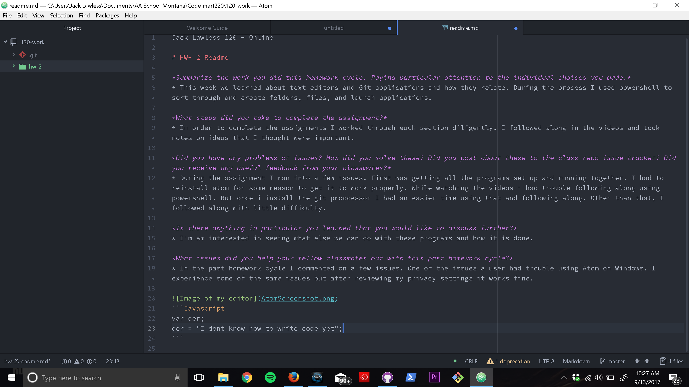

Jack Lawless 120 - Online

# HW- 2 Readme

*Summarize the work you did this homework cycle. Paying particular attention to the individual choices you made.*
* This week we learned about text editors and Git applications and how they relate. During the process I used powershell to sort through and create folders, files, and launch applications.

*What steps did you take to complete the assignment?*
* In order to complete the assignments I worked through each section diligently. I followed along in the videos and took notes on ideas that I thought were important.

*Did you have any problems or issues? How did you solve these? Did you post about these to the class repo issue tracker? Did you receive any useful feedback from your classmates?*
* During the assignment I ran into a few issues. First was getting all the programs set up and running together. I had to reinstall atom for some reason to get it to work properly. While watching the videos i had trouble following along using powershell. But once i install the git proccessor I had an easier time using that and following along. Other than that, I followed along with little difficulty.

*Is there anything in particular you learned that you would like to discuss further?*
* I'm am interested in seeing what else we can do with these programs and how it is done.

*What issues did you help your fellow classmates out with this past homework cycle?*
* In the past homework cycle I commented on a few issues. One of the issues a user had trouble using Atom on Windows. I experience some of the same issues but after reviewing my privacy settings it works fine.


```Javascript
var der;
der = "I dont know how to write code yet";
```
